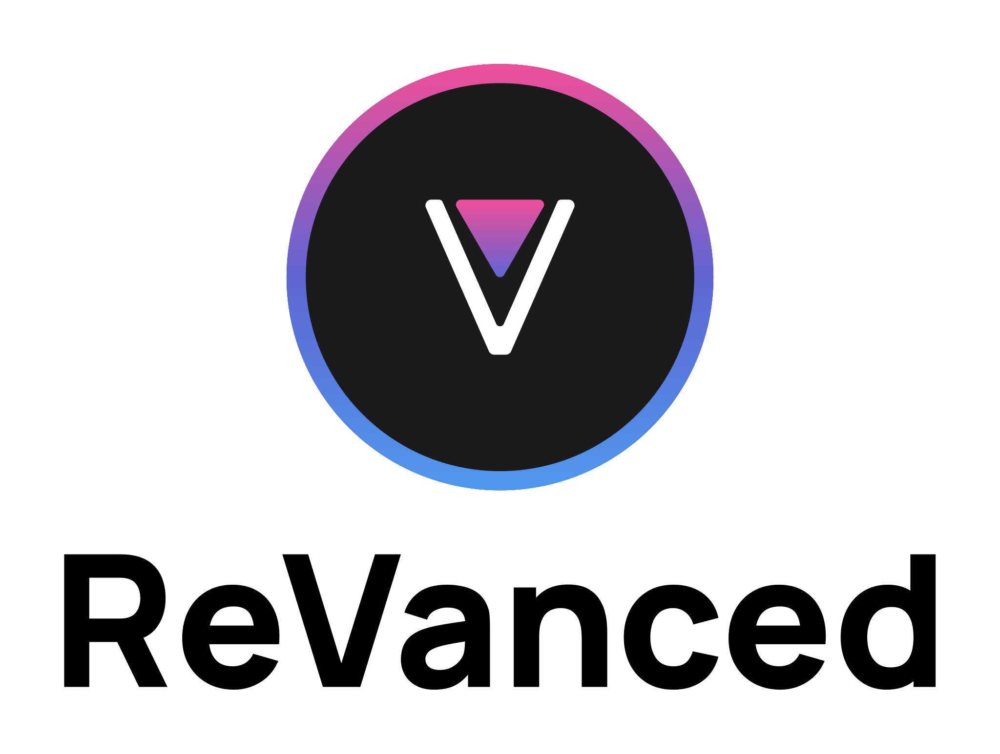

  <picture>
    <source
      width="256px"
      media="(prefers-color-scheme: dark)"
      srcset="assets/revanced-headline/revanced-headline-vertical-dark.svg"
    >
    
  </picture>
   
  <a href="https://revanced.app/">
     <picture>
         <source height="24px" media="(prefers-color-scheme: dark)" srcset="assets/revanced-logo/revanced-logo.svg" />
         
     </picture>
   </a>&nbsp;&nbsp;&nbsp;
   <a href="http://revanced.app/discord">
       <picture>
           <source height="24px" media="(prefers-color-scheme: dark)" srcset="https://user-images.githubusercontent.com/13122796/178032563-d4e084b7-244e-4358-af50-26bde6dd4996.png" />
           
       </picture>
   </a>&nbsp;&nbsp;&nbsp;
    
    

## 🚀 Available Patches
- AZ Screen Recorder (6.4.3)
- Sponge (any)
- Developer Assistant (1.2.2)
- Solid Explorer
- SCRL

### 🛠️ Building

To build ReVanced Patches template,
you can follow the [ReVanced documentation](https://github.com/ReVanced/revanced-documentation).

## 📜 Licence

ReVanced Patches template is licensed under the GPLv3 licence.
Please see the [license file](LICENSE) for more information.
[tl;dr](https://www.tldrlegal.com/license/gnu-general-public-license-v3-gpl-3) you may copy, distribute
and modify ReVanced Patches template as long as you track changes/dates in source files.
Any modifications to ReVanced Patches template must also be made available under the GPL,
along with build & install instructions.
